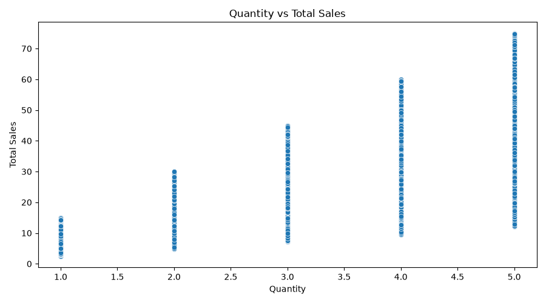
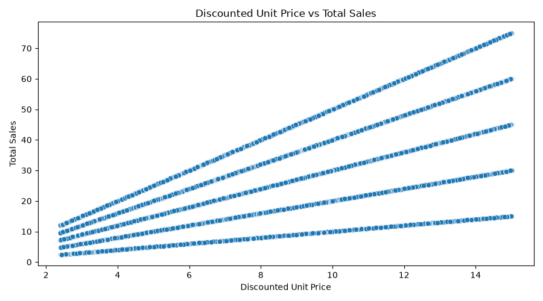
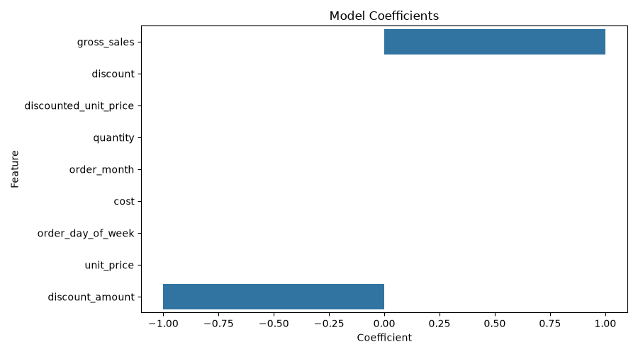

# ml-02-features

> Professional Python project: engineering and selecting features for machine learning.

## Project Description

This project focuses on how to prepare data for machine learning by engineering and selecting features.

The original project focuses on skills such as:

* handling missing values and outliers
* encoding categorical variables
* scaling and transforming numeric features
* selecting features most likely to help a model

For my custom project, I applied these feature-engineering skills to a new data problem using the Chocolate Sales Dataset 2023–2024 from Kaggle.

My custom prediction question is:

**Given quantity, unit price, discount, cost, order month, day of week, and engineered price features, I want to predict total sales.**

This is a supervised regression problem because the model uses known input features to predict a numeric target value, `total_sales`.

## Data Source

The raw dataset used for this project is the Chocolate Sales Dataset 2023–2024 from Kaggle:

[https://www.kaggle.com/datasets/ssssws/chocolate-sales-dataset-2023-2024]

The file `sales.csv` is not committed to this repository because it exceeds the project file size limit. To reproduce the project, download `sales.csv` from Kaggle and place it in:

```text
data/raw/sales.csv
```

## Example Notebook + Your Notebook

Keep the example notebook as it is. Either copy it or use it to build a new notebook that ends in your name.

Links:

* [ml_02_case.ipynb](notebooks/ml_02_case.ipynb)

## Working Files

Important files and folders used in this project include:

* **README.md** - main project landing page
* **data/raw/** - raw data location
* **data/raw/sales.csv** - raw Kaggle data file kept locally only
* **docs/** - project narrative and documentation
* **docs/index.md** - custom project write-up and findings
* **docs/images/** - saved chart images
* **src/mlstudio/app_femi.py** - custom Python app for my technical modification
* **tests/test_app_femi.py** - smoke test for my custom app
* **project.log** - log file created when the app runs
* **pyproject.toml** - project configuration
* **zensical.toml** - documentation configuration

## Technical Modification

For my technical modification, I changed the original example from predicting a student score to predicting chocolate sales.

The original example used student-related features to predict:

```text
score
```

My modified project uses chocolate sales transaction data to predict:

```text
total_sales
```

I renamed the original `revenue` column to `total_sales` because that name is easier to understand as the target variable.

I also created new engineered features:

* `order_month`
* `order_day_of_week`
* `discounted_unit_price`
* `gross_sales`
* `discount_amount`

These features were created from existing columns such as `order_date`, `quantity`, `unit_price`, and `discount`.

This modification is important because the `ml-02-features` project focuses on feature engineering. Creating new features helped me apply the module skills to a realistic business problem.

## Modeling Approach

This project uses supervised learning.

I know it is supervised because the dataset has a known target value that the model is trying to predict.

The target variable is:

```text
total_sales
```

This is a regression task because `total_sales` is numeric. The model predicts a continuous sales amount instead of a category.

The model used in this project is:

```text
LinearRegression
```

Linear Regression is appropriate for this project because the target is numeric and many of the features are directly related to sales amount, such as quantity,
unit price, discount, gross sales, and discount amount.

## Features and Target

The selected target is:

```text
total_sales
```

The selected features are:

```text
quantity
unit_price
discount
cost
order_month
order_day_of_week
discounted_unit_price
gross_sales
discount_amount
```

The original dataset included these columns:

```text
order_id
order_date
product_id
store_id
customer_id
quantity
unit_price
discount
revenue
cost
profit
```

I did not use ID columns such as `order_id`, `product_id`, `store_id`, and `customer_id` directly in the Linear Regression model because they are identifiers.
They would need encoding before being useful as model features.

## Commands Used

Run the custom app from the root project folder:

```shell
uv run python -m mlstudio.app_femi
```

Run the tests:

```shell
uv run python -m pytest
```

Run formatting:

```shell
uv run ruff format .
```

Run linting and automatic fixes:

```shell
uv run ruff check . --fix
```

Run type checking:

```shell
uv run python -m pyright
```

Build documentation:

```shell
uv run python -m zensical build
```

Save progress with Git:

```shell
git add -A
git commit -m "update technical modification, applied skills to new problem"
git push -u origin main
```

## Example Output

When I ran the custom project, the log showed that the Chocolate Sales dataset loaded successfully.

```shell
2026-07-04 11:00:52 | INFO | ML | Loading dataset: sales
2026-07-04 11:00:53 | INFO | ML | Loaded: 1000000 rows, 11 columns
2026-07-04 11:00:53 | INFO | ML | Dataset shape: 1000000 rows, 11 columns
2026-07-04 11:00:53 | INFO | ML | Missing values by column
2026-07-04 11:00:54 | INFO | ML | Duplicate row count: 0
2026-07-04 11:00:54 | INFO | ML | Engineering new features
2026-07-04 11:00:54 | INFO | ML | New features: order_month, order_day_of_week, discounted_unit_price, gross_sales, discount_amount
2026-07-04 11:00:54 | INFO | ML | Clean view: 1000000 rows, 10 columns
2026-07-04 11:00:55 | INFO | ML | Mean absolute error: 0.00
2026-07-04 11:00:55 | INFO | ML | R-squared: 1.00
2026-07-04 11:00:55 | INFO | ML | Predicted total sales: 45.00
2026-07-04 11:05:05 | INFO | ML | Executed successfully!
```

The project loaded:

* 1,000,000 rows
* 11 original columns
* 0 missing values
* 0 duplicate rows

After feature engineering, the clean modeling view had:

* 1,000,000 rows
* 10 columns

The model results were:

* Mean absolute error: `0.00`
* R-squared: `1.00`
* Predicted total sales for one new case: `45.00`

## Findings and Visuals

The custom app saves charts automatically to:

```text
docs/images/
```

### Quantity vs Total Sales



This chart shows the relationship between the quantity purchased and total sales.

### Discounted Unit Price vs Total Sales



This chart shows the relationship between discounted unit price and total sales.

### Model Coefficients



This chart shows how each feature contributed to the Linear Regression model.

## Evaluation and Results

I evaluated the model using regression metrics:

* Mean absolute error
* R-squared

The main result was:

```text
Mean absolute error: 0.00
R-squared: 1.00
```

The model also predicted:

```text
Predicted total sales: 45.00
```

This prediction makes sense because the new case used:

* quantity: 4
* unit price: 12.50
* discount: 0.10

Gross sales would be:

```text
4 * 12.50 = 50.00
```

The discount amount would be:

```text
50.00 * 0.10 = 5.00
```

So the expected total sales would be:

```text
50.00 - 5.00 = 45.00
```

This result is useful because it confirms that the engineered features capture the business calculation behind total sales.
However, one limitation is that some engineered features, such as `gross_sales` and `discount_amount`, are very closely related to the target.
This may explain why the model performance is almost perfect. A future improvement would be to compare results with and without those features.

## Project Documentation

Additional project instructions, terms, and notes:

[docs/index.md](docs/index.md)

## Challenges

One challenge was that the Kaggle `sales.csv` file was too large to commit to GitHub. The pre-commit hook blocked it because it exceeded the file size limit.
I addressed this by keeping the dataset locally and documenting the Kaggle source and required local file path in this README.

Another challenge was making sure the charts were saved automatically. I solved this by updating the app to create the `docs/images` folder and save each figure using `fig.savefig()`.

## Reflection

This project helped me understand how feature engineering can improve a machine learning workflow.
I learned how to create new features from dates, prices, discounts, and quantities. I also practiced applying an example project structure to a new business problem.

This workflow could be applied to real-world problems such as:

* predicting sales
* estimating customer spending
* evaluating discounts
* forecasting product demand
* comparing store performance
* identifying important revenue drivers

## Citation

[CITATION.cff](./CITATION.cff)

## License

[MIT](./LICENSE)
